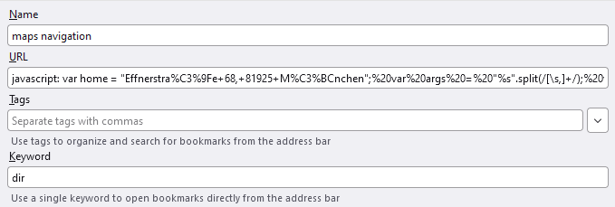

# Simple Bookmarklets with JavaScript

Streamline your browser interaction by using simple JavaScript Bookmarklets with keywords. These allow you to parse multiple parameters per keyword, enabling more complex URL generation.

## Quick Start
This section explains how you can use Bookmarklets to improve you every day experience without going into to much detail.
# Keywork Bookmarks
Everyone knows bookmarks. But did you know know that you can add a keyword to a bookmark?

Now you can open the bookmark simply by typing your keyword into the adress bar!

> eberron

# Bookmarks with a parameter
But some sometimes a static bookmark only gets you so far. What if you want to open Google Maps, but directly jump to your searched location? You can create a bookmark with a parameter so you jump right where you want to go!

Notice the "%s" in the URL? That is the placeholder for your taget. Now you can type:

> maps Time Square

into the adrerss bar and Google Maps will take you straight to Time Square!
# Bookmarklets
This is great for Google Maps, Youtube or other simple request. But for more complex interactions requiring more than one parameter this is not possible. A bookmarklets is javascript code entered instead of a URL allowing for many manipulations, but we focus on simply passing multiple parameters to a website.

The URL is now a small javascript program. You can now request navigation with a simple command:

> dir Time Square, White House, c

This will open a navigation from the Time Square to the White House by car in Google Maps.
## Bookmark and bookmarklet list
In this list bookmarks and bookmarklets I use are stored. Just copy the code into the URL field of the bookmark and choose a keyword of your liking, and you are ready to go! Below the URL/Code the usage is described. Remember to omit the quotation marks! You may also download the *bookmarks.html* file and import all my current macros at once.

### Youtube
`https://www.youtube.com/results?search_query=%s`

> keyword "search"

### Google Maps
`https://www.google.de/maps/search/%s/`

> keyword "search"

### Wikipedia
`http://de.wikipedia.org/w/index.php?search=%s`

> keyword "search"

### Google Scholar

`https://scholar.google.de/scholar?q=%s`

> keyword "search"

### Google Navigation

javascript: var home = "### put in your home adress here ###"; var args = "%s".split(","); var origin = ((args[0] == "home") ? home : args[0].trim()); var destination = ((args[1] == "home") ? home : args[1].trim()); var mode = ""; switch(args[2].trim()) { case "c": mode = "driving"; break; case "b": mode = "bicycling"; break; case "p": mode = "transit"; } document.location.href = "https://www.google.com/maps/dir/?api=1&origin=" + origin + "&destination=" + destination + "&travelmode=" + mode;

> keyword "start", "destination", "travelmode"

"travelmode" can be either "c" for car, "b" for bike or "p" for public transport. Separate parameters by a comma.

### Skyscanner

`javascript: function invert(s) { return s.match(/.{2}/g).reverse().join("") } var args = "%s".split(/[\s,]+/); function main(){ const home = "muc"; var args = "%s".split(/[\s,]+/); var origin = ((args[0] == "home") ? home : args[0]); var destination = ((args[1] == "home") ? home : args[1]); var awaydate = invert(args[2]); var returndate = ((typeof args[3] === "undefined") ? "" : "/" + invert(args[3])); document.location.href = "https://www.skyscanner.com/transport/flights/" + origin + "/" + destination + "/" + awaydate + returndate; } main();`

> keyword "start", "destination", "awaydate"[, "returndate"]

"start" and "destination" need to be Airport IATA-Codes, "returndate" is optional, dates need to be in DDMMYY format. Separate parameters by a comma.

### Can you make me a Bookmarklet?
Just open an issue and I will get to it when I find the time.

### I have more Bookmarklets others might find useful.
Open a merge request.

## Now in more detail
Have a look at the code example. Just write normal js code, put *javascript:* in front of your code, access the passed parameters by *%s*, store the final URL in the *document.location.href* variable and remember to format your code as a oneliner. To do so in VSC highlight the code, press F1 and select "Join Lines".
